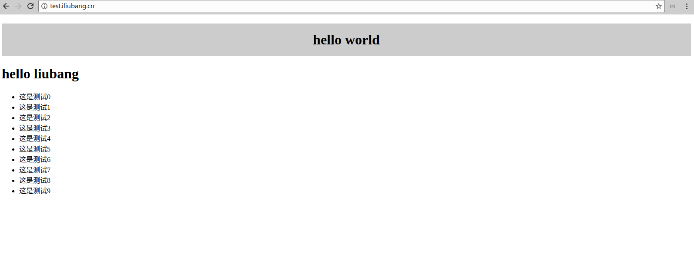
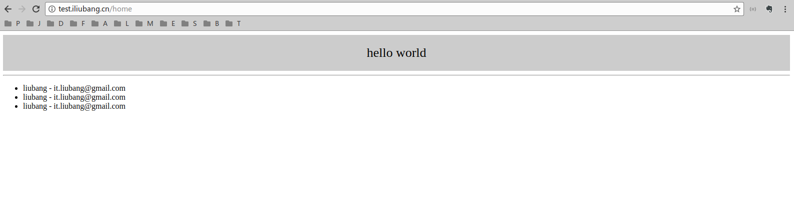

# php_linger_framework_extension

[](https://travis-ci.org/iliubang/linger_framework)

这是一个用c语言编写的PHP框架

**说明：**

本人在php5.6环境中开发，对于php5.6以下版本和php7的兼容将会在后续处理。

## 示例代码

**目录结构**

```
.
├── app
│   ├── boot
│   │   ├── Router.php
│   │   └── Session.php
│   ├── handler
│   │   └── Home.php
│   └── view
│       └── index.html
└── public
    └── index.php
```

**public/index.php**

```php
<?php
define('APP_PATH', realpath(__DIR__ . '/../') . '/');

spl_autoload_register(function ($class) {
    $filename = APP_PATH . 'app/' . str_replace('\\', '/', $class) . '.php';
    if (file_exists($filename)) {
        require $filename;
    }
});

set_exception_handler(function(Exception $e) {
    echo $e->getMessage(),PHP_EOL;
    echo $e->getTraceAsString();
});

$bootclass = [
    \boot\Session::class,
    \boot\Router::class
];
$app = new linger\framework\Application([
    'app_directory' => APP_PATH . 'app'
]);
$app->init($bootclass)
    ->run();
```

**app/boot/Session.php**

```php
namespace boot;

class Session implements \linger\framework\Bootstrap {
    public function bootstrap(\linger\framework\Application $app) {
      \session_start();
    }
}
```

**app/boot/Router.php**

```php
<?php
namespace boot;

use handler\Home;

class Router implements \linger\framework\Bootstrap {
    public function bootstrap(\linger\framework\Application $app) {
        $app->getRouter()
          ->get('/', Home::class, 'index')
          ->get('/home/@userId:([0-9]+)', Home::class, 'home');
    }
}
```

**app/handler/Home.php**

```php
<?php
namespace handler;

class Home extends \linger\framework\Controller {

    public function _init() {
        $this->getView()->setScriptPath(\APP_PATH . 'app/view/');
    }

    public function index() {
        echo \json_encode([
            'status' => 1,
            'message' => $this->getRequest()->getQuery()
        ]);
    }

    public function home() {
        $userId = $this->getRequest()->getQuery('userId');
        \var_dump($userId);
        $userId = $this->getRequest()->getQuery('userId', 10, 'intval');
        \var_dump($userId);
        $userName = $this->getRequest()->getPost("userName", 'liubang');
        \var_dump($userName);
        $this->getView()->assign('name', $userName)
            ->assign('userId', $userId)
            ->assign('list', [
                ['name' => 'liubang', 'email' => 'it.liubang@gmail.com'],
                ['name' => 'liubang', 'email' => 'it.liubang@gmail.com'],
                ['name' => 'liubang', 'email' => 'it.liubang@gmail.com'],
            ])
            ->display('index.html');
    }
}
```


**app/view/index.html**

```html
<!DOCTYPE html>
<html lang="en">
<head>
    <meta charset="UTF-8">
    <title>Title</title>
</head>
<body>
    <?=$this->render('header.html');?>
    <hr>
<section>
    <p>userId: <?=$userId?></p>
    <ul>
        <?php foreach($list as $row) :?>
            <li><?=$row['name']?> - <?=$row['email']?></li>
        <?php endforeach; ?>
    </ul>
</section>
</body>
</html>
```

**app/view/header.html**

```html
<header style="height: 72px; background: #ccc; text-align: center; line-height: 72px; font-size: 26px;">hello world</header>
```

运行效果：




